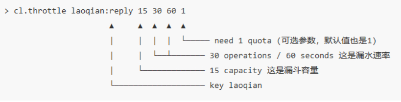
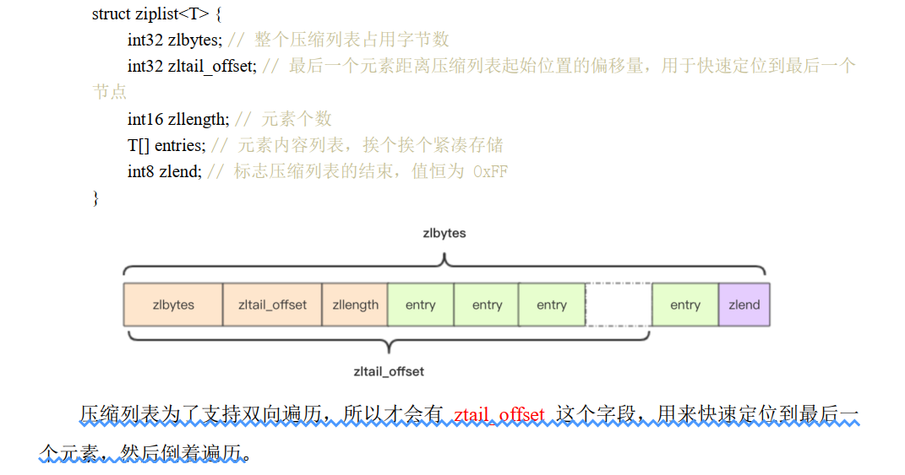

## 1.1 redis

### 1.1.1 什么是redis?

redis 是一款基于内存的高速缓存数据库，全称为 Remote Dictionary Server（远程数据服务），存储的数据格式都是以键值对的形式存在。

### 1.1.2 为什么要用 redis？

* 数据都存储在内存中，访问速度快
* 具有5种数据结构，满足各种业务需求

### 1.1.3 介绍一下redis 的数据结构？

数据结构包括：String、list、set、zset、hash。

所有的数据结构都是由唯一的 key 字符串作为名称，只是 value数据不同。

**1.String**

最基本的数据结构，其内部实现类似于 ArrayList ，都是通过数组来进行存储，并且可以动态扩容。

**2.List**

相当于 LinkedList，所以插入和删除非常快。

**3.Set**

**4.Zset**

可以排序存放，这里要注意*跳表*

**5.Hash**

### 1.1.4 分布式锁

**第一种方法**

`setnx` 和 `del`，这两个指令不是原子操作，中间可能会存在异常或者中断，从而导致锁无法释放，所以可以对获取锁的时间添加时间 `expire` ，但是也可能存在无法执行的情况，主要是这些命令都不是原子性的。

**第二种方法**

通过把以上指令一体化，从而实现了原子性 `set lock:codehole true ex 5 nx`  和 `del lock:codehole`

:zap: redis 的锁本身不支持可重入，需要自己进行实现

### 1.1.5 延时队列

一般是使用 rabbitmq 和 kafka 作为消息队列的中间件，但是如果是一组消费者队列的情况下，可以采用 redis 来作为消息队列。

redis 可以采用 List 数据结构来作为消息队列，但是在面对队列为空的情况下会存在 pop 为空，导致循环查询，降低性能的情况，所以有了 ==blpop 和 brpop== 来代替前面的 pop 方式，当队列为空的时候就会阻塞，等待数据的到来。

**延时队列的实现**

可以通过 `zset` 方式进行实现，吧到期时间作为 `score` 值，然后通过多线程进行轮询，得到到期的任务进行执行，多个线程是避免其中的一些线程出现问题，好及时替换。

:zap: redis 为什么不能保证消息队列的 100% 可靠性？

### 1.1.6 HyperLogLog

有点类似于 `set` ，通过 `pfadd 和 pfcount` 进行操作。HyperLogLog 除了上面的 pfadd 和 pfcount 之外，还提供了第三个指令 pfmerge，用于将多个 pf 计数值累加在一起形成一个新的 pf 值。比如在网站中我们有两个内容差不多的页面，运营说需要这两个页面的数据进行合并。
其中页面的 UV 访问量也需要合并，那这个时候 pfmerge 就可以派上用场了。  

### 1.1.7 布隆过滤器

用来进行去重，如果通过关系数据库或者利用 `set` 来进行去重，那么会存在内存过大或者访问压力的情况。但是通过布隆过滤器可以在节省空间的情况下达到去重效果。

布隆过滤器有二个基本指令， bf.add 添加元素， bf.exists 查询元素是否存在，它的用法和 set 集合的 sadd 和 sismember 差不多。注意 bf.add 只能一次添加一个元素，如果想要一次添加多个，就需要用到 bf.madd 指令。同样如果需要一次查询多个元素是否存在，就需要用到bf.mexists 指令  。

如果没有现实的调用`bf.reserve(key,error_rate,init_size)`，则会采取默认的过滤器设置。这三个参数分别代表的意义如下：

> key：要过滤的集合键值
>
> error_rate:该对象的误判率
>
> init_size:该对象的大小，如果想误判率低就需要初始化大点，但是过大则会导致空间的浪费

### 1.1.8 漏斗限流

存在一种场景，就是对一些用户的回复会在一段时间内限制其操作次数，比如短信验证码需要一分钟才能发一次。 redis 提供了一个采用了漏斗算法的模块 `throttle`。




### 1.1.9 GeoHash

该模块主要用来计算距离，其内部数据结构还是 `zset`。其命令如下

1. 增加

   `geoadd key value1 value2 value3`

2. 距离

   `geodist key  value3 value3 danwei`

3. 获取元素位置

   `geopos key value3`

4. 附近公司

   `georadiusbymember company ireader 20 km count 3 asc`

### 1.1.20 大海捞针-Scan

redis 提供了一个传统的遍历指令 `keys`，会返回所有满足条件的数据，并且是一次性全部遍历，会导致其他指令的延迟。所以提出了新的指令 `scan`，相比于 `keys`，采用指标进行遍历，不会导致指令的延迟，并且提供 limit 。

scan 参数提供了三个参数，第一个是 cursor 整数值，第二个是 key 的正则模式，第三个是遍历的 limit hint。第一次遍历时， cursor 值为 0，然后将返回结果中第一个整数值作为下一次遍历的 cursor。一直遍历到返回的 cursor 值为 0 时结束  

### 1.1.21 redis线程模型

redis 是单线程，那么如何能够实现 10w/s 的QPS呐，主要有以下两点：

> 1.所有数据都在内存中，访问速度块，在跑满单核 CPU 的情况下可以达到
>
> 2.线程采用多路复用的 IO 读取

### 1.1.22 持久化

redis 为了避免在宕机的时候数据的消失，可以进行持久化，方法有两种：快照 和 AOF 日志。

快照是内存数据的二进制序列化形式，在存储上非常紧凑，而 AOF 日志记录的是内存数据修改的指令记录文本。  

**快照**

快照是对内存数据生成二进制数据的快照，需要对文件进行 IO 操作，但是由于 redis 是单线程，为了不影响用户请求的读取，采取的是同时进行，那么会存在在生成快照的时候，数据的修改。所以采取了 COW（cope on write），在要进行修改的时候进行复制，在复制的数据页上进行修改。

**AOF**

记录了内存数据的修改指令，是增量增加的，Redis 在长期运行的过程中， AOF 的日志会越变越长。如果实例宕机重启，重放整个AOF 日志会非常耗时，导致长时间 Redis 无法对外提供服务。所以需要对 AOF 日志瘦身  。

* 重写

  redis 提供了 `bgrewriteaof` 指令用于瘦身，其原理就是开辟一个子进程对内存进行遍历转换成一系列 Redis 的操作指令，序列化到一个新的 AOF 日志文件中。序列化完毕后再将操作期间发生的增量 AOF 日志追加到这个新的 AOF 日志文件中，追加完毕后就立即替代旧的 AOF 日志文件了，瘦身工作就完成了。  

**混合持久化**

如果直接采用 RDB 快照则会导致数据的损失，如果只采用 AOF 又会速度慢，所以引进了 RDB 和 AOF 的混合。 AOF 只记录持久化开始到结束的时段。

### 1.1.23 管道

管道不是 redis 提供的技术，而是客户端通过改变了读写的顺序带来的性能的提升。redis 对于客户端的指令主要分为四部分增加：命令的发送、在队列中的等待时间、命令执行时间、命令返回时间。

### 1.1.24 事务

redis 也提供事务，但是只保证事物的隔离性，并不能完全满足 ACID。而之所以满足事务隔离性是由于 `redis 是单线程的，不用担心其他事务的影响。`其事务的命令如下：

`multi` 开启事务，所有的指令在` exec` 之前不执行，而是缓存在服务器的一个事务队列中，服务器一旦收到 exec 指令，才开执行整个事务队列，执行完毕后一次性返回所有指令的运行结果  。由于每添加一个指令到事务队列都会进行一次网络 IO 操作，如果指令过多会造成 IO 时间的线性增长，所以可以结合管道来使用。

**watch**

redis 的分布式锁是一种悲观锁，通过 `watch` 可以达成乐观锁，类似于 CAS。对于 `watch 的变量`，如果在事务开始之前进行了修改，则会在 `exec` 指令运行的时候返回 `null`。

:zap:为什么 redis 不支持事务回滚？

> 只有当发生语法错误(这个问题在命令队列时无法检测到)了，Redis命令才会执行失败, 或对keys赋予了一个类型错误的数据：这意味着这些都是程序性错误，这类错误在开发的过程中就能够发现并解决掉，几乎不会出现在生产环境。由于不需要回滚，这使得Redis内部更加简单，而且运行速度更快。

### 1.1.25 PubSub

redis 中基于基本的`5种数据结构的`消息队列不能 支持消息多播传送，所以使用了一个单独的模块`pubsub（发布者订阅者模式）来实现`。

### 1.1.26 内存分配和回收

redis 的内存回收不是不用了就立即回收，redis 的回收时按照页来进行回收的，如果页当中有一个 key 不为空，都会造成该页不被回收，但是为空的那些位置可以被重复利用。

### 1.1.27 主从同步

**CAP：**分布式存储的理论基础，分别为一致性、可用性和分区容忍性。

redis 保证了可用性，即在网络断开的情况下，主节点仍然可以进行修改操作，并且和从节点实现最终一致性。Redis 同步的是指令流，主节点会将那些对自己的状态产生修改性影响的指令记录在本地的内存 buffer 中，然后异步将 buffer 中的指令同步到从节点，从节点一边执行同步的指令流来达到和主节点一样的状态，一遍向主节点反馈自己同步到哪里了 (偏移量)。  

### 1.1.28 哨兵（Sentinel）

用来监控主从节点的状态，当故障发生时候可以自动进行从主切换。当主节点挂掉时，自动选择一个最优的从节点切换为主节点。客户端来连接集群时，会首先连接 sentinel，通过 sentinel 来查询主节点的地址，然后再去连接主节点进行数据交互。当主节点发生故障时，客户端会重新向 sentinel 要地址， sentinel 会将最新的主节点地址告诉客户端  

**信息丢失**

redis 主从采用异步复制，可能存在主节点挂掉时，从节点还没接受完全部的同步信息。 Sentinel 通过以下两个指令来保证消息的不丢失。

```python
min-slaves-to-write  1
min-slaves-max-lag 10
```

### 1.1.29 分而治之-Codis

codis 起到代理的作用，能够充分利用多个 redis 集群之间的内存和运行。

codis 通过 计算每个 key 值对应的 hash来进行映射到槽位，每个槽位对应存放的 redis 实例。

### 1.1.30 过期策略

所有设置了过期时间的 key 都放入到一个单独的字典中，后面会定时遍历字典来删除到期的 key。除了定时删除以外，还有一种懒式删除方法，每次 get 的时候都看是否过期。

**定期扫描策略**

Redis 默认会每秒进行十次过期扫描，过期扫描不会遍历过期字典中所有的 key，而是采用了一种简单的贪心策略 。

> 1.从过期字典中随机 20 个 key;
>
> 2.删除 20 个 key 中已经过期的 Key;
>
> 3.如果过期的 key 比率 超过 1/4，则重复步骤1；

### 1.1.31 压缩列表

对于 zset 和 hash 结构来说，当元素较少的时候会用压缩列表进行存储，压缩列表的结构如下：



