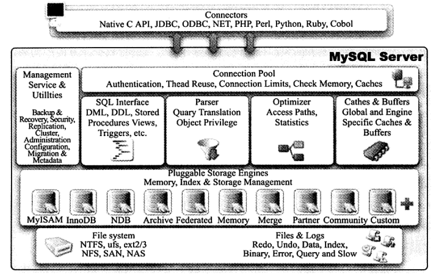
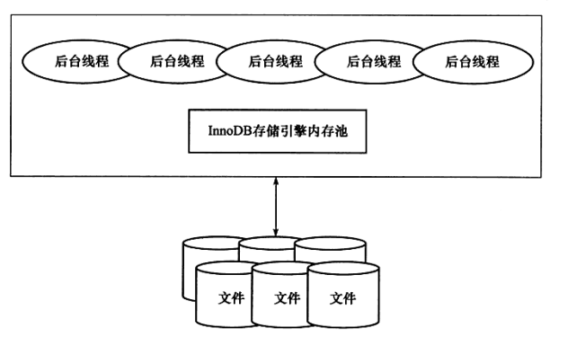
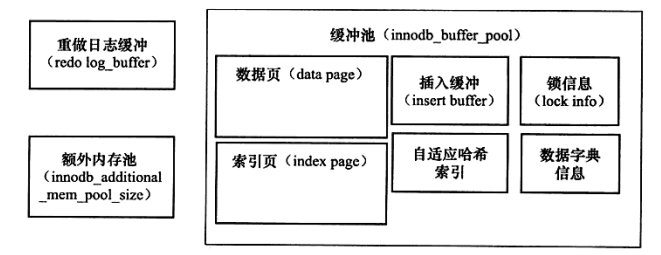

## Mysql

### Mysql 的体系结构

Mysql 主要由以下几部分组成：连接器、缓存、分析器、优化器、执行器以及存储引擎。

:zap: Sql 语句的执行顺序？

> 当输入一个语句的时候，首先通过连接器进行连接，连接的时候需要验证权限；
>
> 验证通过后先从缓存中查找是否存在，存在则直接返回，否则通过分析器对语句执行分析；
>
> 分析语句通过后则执行优化，看是否有索引，以及使用什么索引；
>
> 优化器优化后则通过执行器进行语句执行，执行器是通过调用引擎提供的接口来进行执行；

### Innodb 存储引擎的体系结构

InnoDB 主要由三部分组成：后台线程、共享内存以及磁盘文件；

**1.后台线程**

后台线程分为以下几个：Master Thread、Purge Thread、IO Thread、Clearn Thread

* Master Thread

  核心线程，主要负责缓冲池脏页的刷新、日志的刷新、合并插入缓冲、Undo 页回收等

* IO Thread

  InnoDB 中的脏页都是通过 AIO 刷新到磁盘中，IO Thread 主要负责这些回收的回调

* Purge Thread

  用来进行 undo 页的回收，分担 Master Thread 中的工作，减轻其压力，从而提高 CPU 的利用率以及提升引擎的性能

* Cleaner Thread

  用来进行脏页的刷新工作，减轻 Master Thread 的工作

**2.内存**

内存主要分为以下几大块：缓冲池、重做日志缓冲池、额外内存池。

* 缓冲池

  由于 CPU 和磁盘之间存在速度鸿沟，所以使用缓冲池来弥补这个缺点，当读取数据的时候首先查看缓冲池中是否有，没有再去磁盘读取，并且把读取的数据页放在缓冲池中，以备下一次使用。同样，修改也是修改缓冲池中的数据页。

  