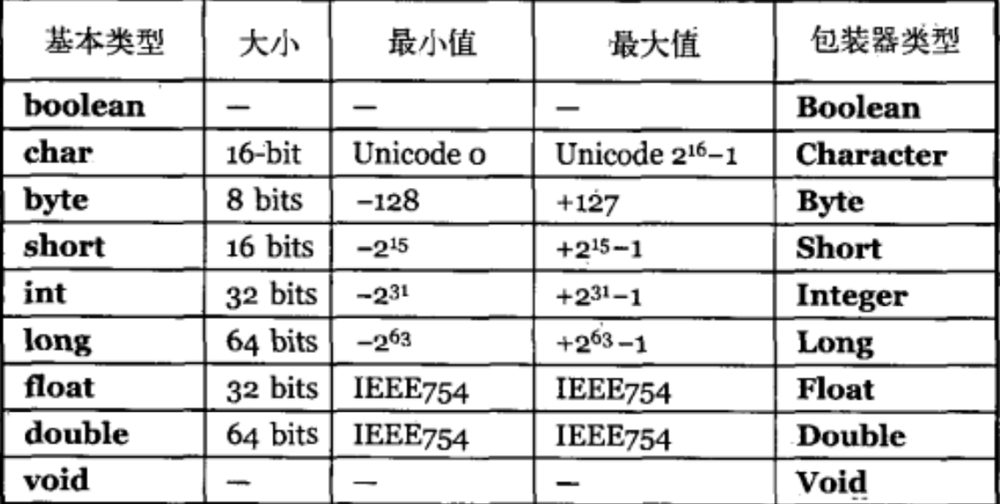
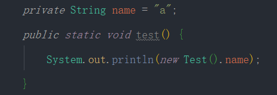

## 2.1 java基础

### 2.1.1 java的特性

* 面向对象：封装、继承和多态

  > **封装**：把对象的属性进行私有化，阻止其他对象的访问，对于允许其他对象能访问的属性则提供公开的方法进行访问。
  >
  > **继承：**选用其中一个类作为基础类，可以通过对该类进行继承，从而拥有该类的方法和属性，并且可以进行自己方法和属性的扩充，但是对于被继承类的私有属性或者方法，只能拥有不能使用。
  >
  > **多态：**调用同一个方法可能返回不同的结果，因为该方法可能来源于不同子类型的对象。多态分为编译时的多态和运行时的多态性。对于方法重载来说是实现的编译时的多态，而方法重写实现的是运行时的多态性。其中运行时的多态主要面向继承和接口实现两方面。

* 自动内存回收

* 数组安全

### 2.1.2 java的引用

**1.引用的作用：**引用的作用类似于*C++的指针*，用来指定所要使用的数据的位置。

**2.引用的作用域：**对于静态引用放在方法区当中，所有类对象都可以使用；对于实例对象引用则放在堆中， 只有该实例对象使用；对于方法中的引用则其作用域为方法内部。

### 2.1.3 基本类型和对象类型的区别

**基本类型：**不能用*new*来创建变量，而是创建一个并非是引用的*自动*变量，这个变量直接存储*值*，放于堆栈中。

**对象类型：**使用*new*创建，并且位于堆中。

### 2.1.4 基本类型的大小

基本类型都有自己的固定的空间，不会随着硬件的改变而改变。



### 2.1.5 包装器和基本类型的区别

每个基本类型都有对应的包装器类型，能够在堆中创建一个非基本类型对象，用来表示基本类型。

**两者区别：**

* 创建方式不同
* 对象所在位置不同
* 对于 Integer 和 int 来说， Integer 的值可以为 null ，而 int 不能为 null
* Integer 的值在 -128 ~127 的时候会缓存，如果创建的新对象在该区间则会调用常量池中的的对象

### 2.1.6 成员变量和局部变量的区别

* **是否初始化：**成员变量可以自动初始化，而局部变量必须人为赋值
* **权限修饰符：**成员变量可以采用任何权限修饰符，而局部变量只可以使用*final*
* **作用域：**成员变量作用域为整个实例对象，而局部变量则是方法内部
* **所处位置：**成员变量的位置为堆，而局部变量则是java堆栈中

### 2.1.7 访问修饰符的区别

public > protected > default > private

| 修饰符    | 当前类 | 同包 | 子类 | 其他包 |
| --------- | ------ | ---- | ---- | ------ |
| public    | √      | √    | √    | √      |
| protected | √      | √    | √    | ×      |
| default   | √      | √    | ×    | ×      |
| private   | √      | ×    | ×    | ×      |

### 2.1.8 String详解

*String*是不可变的的，其底层数据结构是字节数组。


**String 中的 +、+=**是 Java 中仅有的两个重载过得操作符。

* String 的创建方式：

  ```java
  // 首先看字符串常量池中有没对于字符存在，有则直接返回引用地址，没有则创建字符并且返回引用地址
  String str = "a";
  // 在堆上创建一个String对象，如果字符串常量池有对应字符串，则指向该字符串，没有则创建字符并且指向该字符串
  String str1 = new String("a");
  // 在编译期间就进行优化变为”ab“，后面的过程和第一个创建方式一样
  String str2 = "a" + "b";
  // 由于有变量，需要运行时创建，会自动创建new StringBuilder();
  String str3 = "a" + str;
  // 对于final常量，会自动进行替换。
  final String a = "a";
  final String b = "b";
  String c = a + b;
  ```

* String.intern() 解析

  intern() 的使用分为两种，一种是 JDK7 之前，此时对于第一次遇见的字符串会首先在字符串常量池中进行字符串的复制，并且返回引用。还有一种则是 JDK7 ，对于第一次遇见的字符串不是直接在常量池中进行字符串的复制，而是把对应实例对象的引用放入常量池中，并且返回该引用。

### 2.1.9 Math.round(11.5) 和 Math.round(-11.5) 分别等于多少

Math.round(11.5) 的返回值为 12，Math.round(-11.5) 的返回值为 -11。四舍五入的原理是在参数上加*0.5*然后向下取整。

### 2.1.10 为什么 hashCode 和 equal 需要同时重写

hashCode 用来获得对象的哈希码，如果不进行重写的话则默认以对象的内存地址进行编码，那么对象的hashCode 会永远不相等，同样，equal 的默认是比较对象地址是否相等，所以需要两者同时重写。

**hashCode 和 equal 的关系**

> hashCode 相等，不代表 equal相等
>
> equal 相等，则 hashCode 一定 相等

### 2.1.11 java 中方法的传递是值传递还是引用传递？

都是值传递。当为基本类型的时候值传递传递的是基本类型的值副本，所以不会影响原始值。同样，当传递引用对象的时候，传递的是引用对象的地址，会对原始对象进行改变。

### 2.1.12 抽象和接口的异同

* **能否实例化：**都不能实例化
* **内部方法：**抽象的方法可以有具体实现，而接口的方法不能有实现方式
* **权限修饰符：**抽象的成员可以是任何修饰符，而接口的只能是 public
* **实现方式：**抽象是继承，如果不全部实现则还是抽象类，接口则是实现，并且必须全部实现

### 2.1.13 静态方法和实例方法中对于外部的调用区别？

**静态方法**：不依赖于实例对象，所以可以直接调用静态变量和方法，但是调用实例方法的时候需要先实例化。

**实例方法：**可以调用任何变量和方法。



### 2.1.14 请分析以下代码是否有问题？

```java
public class Stack {
    private Object[] elements;
    private int size = 0;
    private static final int DEFAULT_INITIAL_CAPACITY = 1;

    public Stack() {
        elements = new Object[DEFAULT_INITIAL_CAPACITY];
    }

    public void push(Object e) {
        ensureCapacity();
        elements[size++] = e;
    }

    public Object pop() {
        if(size == 0)
            throw new EmptyStackException();
        return elements[--size];
    }

    /*
     * 该方法用于判断数组空间中是否至少有一个空余空间，如果没有就对数组进行扩容
     * */
    private void ensureCapacity() {
        if(elements.length == size)
            elements = Arrays.copyOf(elements, 2 * size + 1);
    }
}
```

该代码初看是没有任何问题， 但随着垃圾回收器的活动增加，性能会逐渐降低，原因就是存在内存泄漏。那么内存是怎么泄露的呐？当我们执行 pop 方法的时候返回的是数组的一个值，但是数组仍然保持着对该值的引用，并且我们不会再使用这个引用。

为了避免内存泄漏该代码中的 pop 方法应该这样修改

```java
public Object pop() {
    if(size == 0)
        throw new EmptyStackException();
    Object result = elements[--size];
    elements[size] = null;
    return result;	
}
```

### 2.1.15 String s = new String(“xyz”)创建了几个字符串对象？

标准答案是分情况讨论：

1. 如果字符串常量池有*xyz*，则只在堆上创建一个*String 对象*。
2. 如果字符串常量没有该值，则在常量池创建一个*xyz*，然后再堆上创建一个*String 对象*。

### 2.1.16 匿名内部类是否可以继承其他类？是否可以实现接口？

都可以。内部类分为静态内部类、成员内部类、方法内部类以及匿名内部类

**.this 和 .new**

当需要在内部类中创建外部类的时候，通过*类名.this* 的方法来返回

当需要对内部类进行实例化的时候则是`OutClass.InerClass obj = outInstance.new InnerClass()`

### 2.1.17 内部类引用外部类的限制

如果 非静态内部类则没有任何限制，如果是静态内部类则只能引用静态成员。

### 2.1.18 final关键词的用法有哪些？

1. 用在类上表示类不能继承
2. 用在方法上表示方法不能重写
3. 用在基本类型上表示不能改变
4. 用在数组或者引用对象上表示引用地址不能变

### 2.1.19 try 和 final 的执行顺序

finally 执行顺序是在方法返回调用者前执行，但是如果在 finally 中有改变返回值的行为，那么 finally 对其的影响分为两种情况：

**a、对于基本类型或常量(如String) finally里即使修改了，也不会影响返回结果。**

**b、如果是对象类型，finally里修改了对象 是影响返回结果的。（因为复杂对象传递的是指针 指针指向的内存区域是一样的。）**

### 2.1.20 线程的 sleep 方法和 yield 方法有什么区别？

1. sleep 方法给其他线程运行机会时不考虑线程的优先级，而 yield 只会给相同优先级或者更高优先级的线程以运行的机会
2. 线程执行 sleep 方法后转入阻塞状态，而执行 yield 方法后转入就绪状态
3. sleep 方法抛出 InterruptedException，而 yield 方法没有声明任何异常
4. sleep 方法比 yield 方法具有更好的可移植性