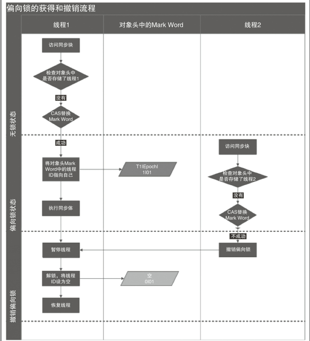
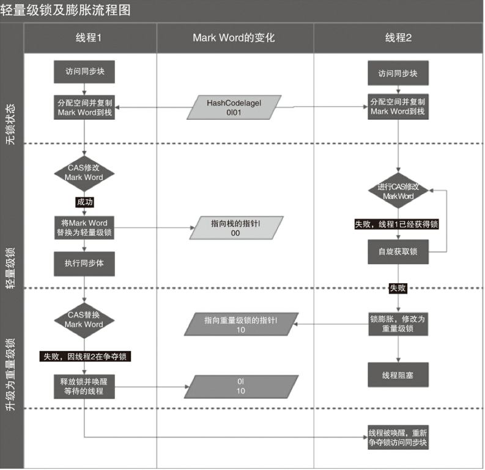

## 2.3 Java多线程

### 减少上下文切换

* 无锁并发编程
* CAS 算法
* 使用最少线程
* 协程

### volatile 使用及原理

volatile 用于变量中，保证其可见性。

volatile 基于 JVM 和 CPU 指令进行实现，CPU 内部有个寄存器用来当做缓存，用来弥补之间的速度鸿沟。而加了 volatile 的变量会导致直接写入到内存中，并且使其他 CPU 中的内存地址失效。

### synchronized

jdk6 之前的 synchronized 是重量级锁，采用的是操作系统中的 mutex lock 进行加锁。在 jdk6 后对之进行了 优化，采用了无锁、偏向锁、轻量级锁、重量级锁的方式，且只能升级不能降级的方式。

**偏向锁**



**轻量级锁**



### suspend、resume、stop

suspend 不会对资源进行释放，若易导致死锁问题；

stop 也会导致资源无法正常释放；

## ArrayList 详解

**主要参数**

elementData：存放数据的数组

DEFAULTCAPACITY_EMPTY_ELEMENTDATA：默认的静态常量，无参构造中赋值给 elementData

size：当前数组中已存放数据个数

**初始化**

ArrayList 的底层数据结构是一个  Object 的*数组*，所以初始化就是对数组进行初始化。其初始化分为三种：

1. 带参初始化：传递了数组容量大小

2. 传递其他容器进行初始化

3. 无参初始化

   对于无参初始化需要注意的时，此时并没有对数组进行赋值默认容量，而是初始化为空。

   ```java
   
   private static final Object[] DEFAULTCAPACITY_EMPTY_ELEMENTDATA = {};
   // 此时的数组容量为0，当第一次添加的时候才会进行容量增加。
   public ArrayList() {
           this.elementData = DEFAULTCAPACITY_EMPTY_ELEMENTDATA;
       }
   ```

**数据的添加**

add 的源码如下

```java
  public boolean add(E e) {
        // 数组容量判断，不够则扩容
        ensureCapacityInternal(size + 1);  // Increments modCount!!
        elementData[size++] = e;
        return true;
    }
```

### ArrayList 和 LinkedList 的异同？

* **数据结构：**ArrayList 底层数据结构为 Object 类型的数组，而 LinkedList 则是双向链表。
* **数据的插入和删除：**ArrayList 由于是数组，所以插入和删除相对于 LinkedList 来说缓慢。
* **数据的查询：**ArrayList 支持随机访问，而 LinkedList只能从头访问。
* **内存消耗：**ArrayList 的消耗主要是由于数组的容量剩余，而 LinkedList 是由于每个节点要存储指向前驱和后驱节点的信息。