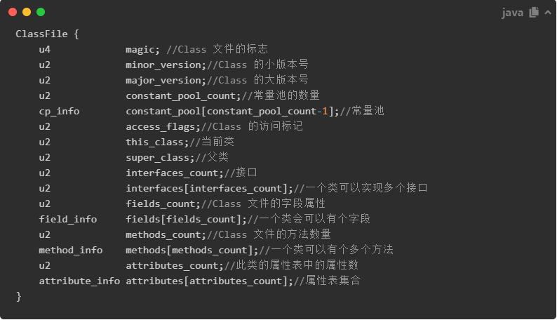

## 2.4 JVM

### 2.4.1 jdk8 之前 和之后的内存划分区别？

*JDK8* 前后的主要区别是*方法区*的划分，在之前方法区还存在，并且有JVM本身控制其大小，而在之后则取消了方法区，在直接内存中划分了一段区域用来替代方法区，叫做元数据空间，这个区域的大小受本机内存的限制。并且运行时常量池放在了堆中。

### 2.4.2 Mnior GC 和 Full GC 的区别？

* **发生位置：**Mnior 发生在新生代，而 Full GC 发生在整个堆。
* **回收速度：**Mnior 发生频繁并且速度快，而 Full 发生的次数相对较少但是速度慢。

### 2.4.3 类的回收条件？

类的回收相比于常量的回收来说更加复杂，需要以下条件：

* 该类的所有相关实例都已经被回收	
* 加载该类的 ClassLoader 已经被回收
* 加载该类的 Class 对象没有在任何地方被引用，无法在任何地方通过反射访问该类的方法

### 2.4.4 client 和 server 下的虚拟机的区别？

我们使用的HotSpot中内置了两个JIT编译器，即C1编译器和C2编译器，默认采用的是解释器和一个编辑器配合的方式进行工作。HotSpot在启动的时候会根据自身版本以及宿主机器的硬件性能自动选择运行模式，比如会检测宿主机器是否为服务器、比如J2SE会检测主机是否有至少2个CPU和至少2GB的内存。

**1、如果是，则虚拟机会以Server模式运行，该模式与C2编译器共同运行，更注重编译的质量，启动速度慢，但是运行效率高，适合用在服务器环境下，针对生产环境进行了优化**

**2、如果不是，则虚拟机会以Client模式运行，该模式与C1编译器共同运行，更注重编译的速度，启动速度快，更适合用在客户端的版本下，针对GUI进行了优化**

### 2.4.5 Class 文件结构

每个 Class 文件都有固定的结构，其固定格式如下：

### 2.4.6 字符串常量池、Class  常量池、运行时常量池

**字符串常量池**

生成阶段是在验证、准备阶段之后，在堆中生成字符串对象实例，然后将对应字符串对象实例的引用值存到==String pool 中==。

**class 常量池**

当java文件被编译成class文件之后，会在class文件中生成我们所说的class常量池，class文件中除了包含**类的版本、字段、方法、接口**等描述信息外，还有一项信息就是常量池(constant pool table)，用于存放编译器生成的各种**字面量**(文本字符串、被声明为final的常量、基本数据类型的值)和**符号引用**(类和接口的全限定名、字段的名称和描述符、方法的名称和描述符)。

**运行时常量池**

当类加载到内存中后，jvm就会将class常量池中的内容存放到运行时常量池中，由此可知，运行时常量池也是每个类都有一个。在上面我也说了，class常量池中存的是字面量和符号引用，也就是说他们存的并不是对象的实例，而是对象的符号引用值。而经过解析（resolve）之后，也就是把符号引用替换为直接引用，解析的过程会去查询字符串常量池，也就是我们上面所说的string pool，以保证运行时常量池所引用的字符串与字符串常量池中所引用的是一致的。

### 2.4.7 类的创建

1. 遇到 new 指令后就去看参数是否可以再常量池中找到一个类的符号引用，并且检查该符号引用是否已被加载、解析和初始化过，如果没有则要执行类加载过程；
2. 通过类检查后则会分配内存空间，其大小在编译的时候就确定了的；
3. 然后是对所有字段赋零值；
4. 接着是设置对象头：包括该对象对应类的类型、元数据、GC年龄等；
5. 执行 init 方法，按照程序员的意愿赋值；

