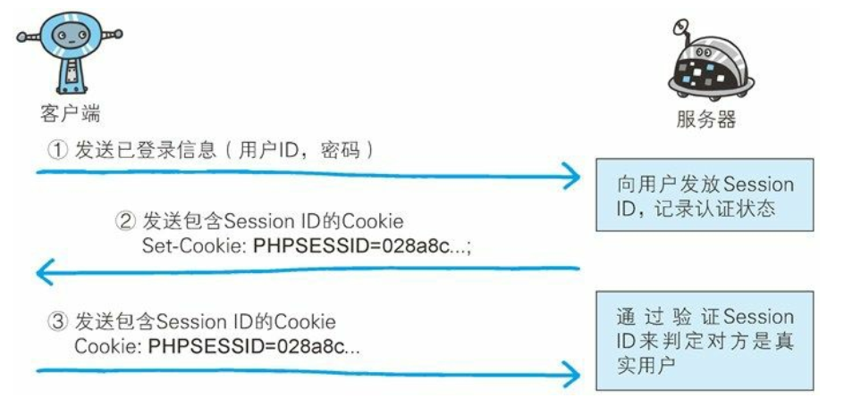

## 3.1 网络协议

### 3.1.1 何为Http?

*Http*全称为*超文本传输协议*，是一种规则的约束，web基于Http进行运作。

### 3.1.2 OSI参考模型

从上往下分为以下*七层：*应用层、表示层、会话层、传输层、网络层、数据链路层、物理层。每个层都有自己的具体作用，并且遵循对应的协议。

**1.应用层**

**2.表示层**

把每个数据固有的格式转化为适合网络传输的格式，或者把网络传输的格式转化为上层能处理的格式。该层主要负责数据格式的转换。

**3.会话层**

负责主机之间的链接

**4.传输层**

定义了传输数据的协议和端口号

**5.网络层**

对于数据包中的IP地址进行封装和解析

**6.数据链路层**

对于数据包中的MAC地址进行解析和封装。这一层的数据叫做帧

**7.物理层**

定义物理标准，主要作用是传输比特流。

### 3.1.3 服务器请求方法区别

* GET

  获取资源，用来请求访问已被 URI 识别的资源。

* POST

  传输实体主体，虽然可以用 GET 传输，但一般都是用 POST

* PUT

  传输文件

* HEAD

  获取报文首部，HEAD 和 GET 方法一样，都是请求资源，但是 HEAD 只会返回报文首部，验证请求 URI 的有效性及资源更新的日期

* DELETE

  和 PUT 相反， 用来删除指定 URI 的文件

* OPTIONS

  询问支持的方法

### 3.1.4 短连接、长连接

HTTP 首先通过 TCP 进行连接，然后进行数据的传输，当数据传输完成则会进行连接的释放，每次请求都会执行一次该流程，会造成额额外的开销。通过长连接，即连接后不马上释放，而是运行其他请求继续使用该连接。而管线技术则是允许并行发送请求。在长连接的基础上更加提高了速度。

### 3.1.5 Cookie

HTTP 是无状态协议，不会保存以前请求和响应的状态，那么如果一个用户通过了登录后，再请求其他页面的时候是否也要登录，所以通过 Cookie 技术来保存用户状态，当用户发送请求到服务器登录后，服务器会在响应报文中设置 cookie 信息，这样客户端在以后的请求中都会携带该信息。

### 3.1.6 状态码类别

### 3.1.7 通信数据转发程序

* 代理

  客户端发送的请求会首先发送到代理，由代理发给服务端；同样，服务端的响应也会先发送到代理然后转发给客户端。代理不止起到转发的作用，还可以起到缓存和对内容加工的作用。

* 网关

  具有服务端相同资源，可以直接处理客户端请求。

* 隧道

  隧道的目的是确保客户端能与服务器进行安全的
  通信。  

### 3.1.8 HTTP 和 HTTPS

HTTP 是一种无状态协议，并且是采用明文来传输报文，可能存在报文泄漏、报文篡改、服务端伪装的情况。而 基于 SSL 的HTTP 则可以避免以上三种情况。

SSL 对客户端和服务端之间的通信进行加密，并且可以验证客户端和服务端的证书，从而确定两方是否真实存在。

HTTP 加上加密处理、完整性验证、认证就是 HTTPS。其是在 HTTP 和其他协议一起完成这三样功能。

### 3.1.9 加密算法

加密算法分为共享密钥加密和公开密钥加密。

* 共享密钥加密

  共享密钥加密是客户端和服务端共同拥有一个密钥，加密和解密都需要这个密钥。但是如何把这把密钥传送给服务端是问题。

* 公开密钥加密

  客户端利用服务端的公开密钥进行加密，而服务端则利用私有密钥进行解密。

SSL 是基于公开密钥加密，而 HTTPS 则是采用混合的加密方式，由于共享加密的速度比公开密钥速度快，所以采用两者的优点进行结合，先通过公开密钥加密方式传送密钥，然后以后的通信都采用共享密钥。

### 3.1.10 Cookie 和 Session 的区别和关系

Cookie 多用来保存用户信息并且是在浏览器。

Session 用来保存用户状态。

Cookie 用来管理 Session。步骤如下：

> 1.客户端把用户和密码等登陆信息放入报文的实体部分，通常是以 POST 方法吧请求发送给服务器。
>
> 2.服务器会验证用户发送过来的信息，并且把用户的认证状态与 SessionID 绑定后记录在服务端，并且把 SessionID 发送给客户端。客户端收到响应后，会把 SessionID 当做 Cookied保存在本地。下次再向服务端发送请求的死后，浏览器会自动发送 Cookie。

