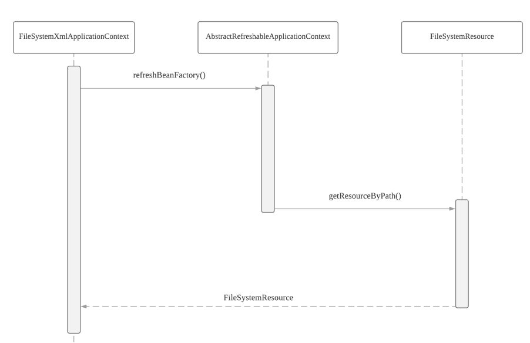
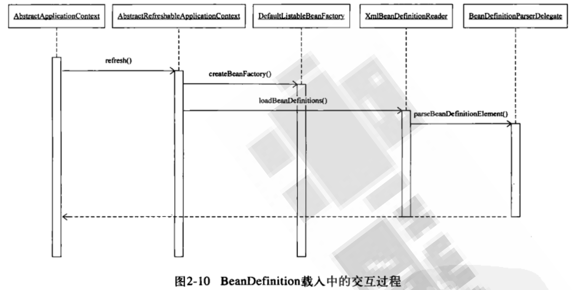
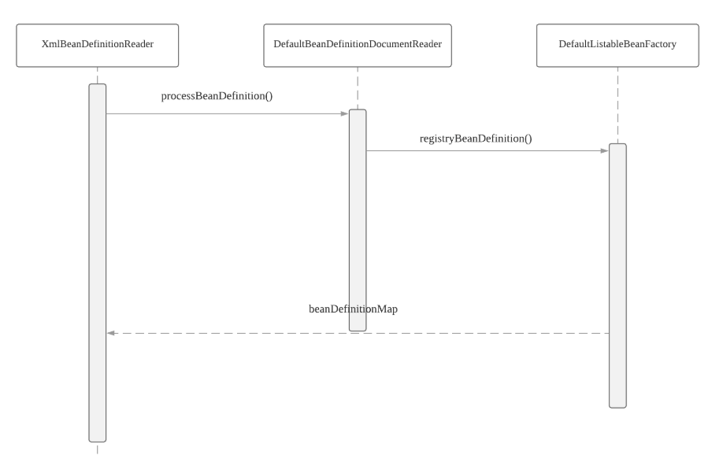

## Spring

### BeanFactory 和 ApplicationContext

IOC 容器有两个主要容器类：一个是实现了 `BeanFactory` 接口的简单容器系列，只包含基本的容器功能；另一个是 `ApplicationContext` 应用上下文，它是容器的高级形式，在简单容器的基础上增加了需要面向框架的特性。

### IOC 容器的初始化过程

IOC 容器的初始化是由 `refresh()` 来启动的，标志着初始化的开始。这个启动包含三个基本过程： `BeanDefinition` 的 `Resource`  定位、载入和注册。

**1.定位**

由 `ResourceLoader` 通过统一的 `Resource` 接口来完成，对不同的 `BeanDefinition` 得使用都提供了统一接口。

**2.载入**

把用户定义好的 `Bean` 表示成容器内部的数据结构，而这个容器内部的数据结构就是 `BeanDefinition`。

**3.注册**

向 IOC 容器注册这些 `BeanDefinition`，是通过调用接口 `BeanDefinitionRegistry` 接口来实现。都会注入到一个 **HashMap** 中去。

:zap: `BeanDefinition` 的载入和依赖注入是两个独立的过程。依赖注入一般发生在第一次通过 `getBean` 向容器索取 `Bean` 的时候。除非对 Bean 定义了 **lazyinit 属性**。

### IOC 容器的依赖注入

